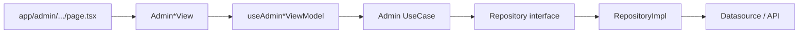

# Admin Panel Design — Angel Starch USA

Design for an **Admin Panel** on top of the current Next.js website (`website_usa`), using the same **MVVM + Clean Architecture** approach already used for the public storefront.

---

## 1. Goals

| Goal | Description |
| --- | --- |
| Super Login | Dedicated `/admin/login` for `super_admin` / `admin` (not customer `/account/login`) |
| CRUD Users | Manage customer / admin / super_admin accounts |
| CRUD Categories | Manage shop categories (Native Starch, Organic, Sweetener, etc.) |
| CRUD Products | Manage catalog products (price, image, MOQ, packaging) |
| CRUD Product Details | Manage overview, features, applications, specifications |
| Home CMS | Edit home page sections (hero, favorites, stats, navigation CTAs) |
| Architecture | Keep Presentation / Domain / Data separation (MVVM + Clean Architecture) |

Public site continues to read through repositories + use cases. Admin writes through the same domain contracts; data layer later swaps from `*.local.ts` to API/DB.

---

## 2. Current site mapping (source of truth today)

| Public area | Current data | Admin module |
| --- | --- | --- |
| Shop / Products catalog | `shop-catalog.local.ts` | Categories + Products |
| Product detail pages | `shop-product-details.native.local.ts` + `ShopProduct.details` | Product Details |
| Auth accounts | `AuthContext` + localStorage users | Users + Super Login |
| Home | `home-content.local.ts` | Home Pages |
| Certifications | `certifications.local.ts` | (optional phase 2) |
| About / Contact | about/contact locals | (optional phase 2) |

### Existing shop entities (extend, do not fork)

- `ShopCategoryId`, `ShopCategory`, `ShopProduct`, `ShopProductDetails`, `ShopProductSpec`
- `UserProfile`, `StoredUser`, `AuthSession`
- `HomeContent` (hero, navigation, products spotlights, stats, whyPartner, favorites)

---

## 3. Architecture (MVVM + Clean Architecture)

```text
src/
  app/admin/                 # Admin Next.js routes (thin pages)
  domain/
    entities/                # Shared + admin-extended entities
    repositories/            # Contracts (read + write)
    usecases/
      admin/                 # Create/Update/Delete + list use cases
  data/
    datasources/             # Local now → HTTP/DB later
    repositories/            # Implementations
  presentation/
    admin/
      components/            # Admin shells, tables, forms
      viewmodels/            # useAdmin*ViewModel hooks
  di/                        # Wire admin use cases
```

### Dependency rule (same as public site)

- `presentation` → `domain` (+ ViewModels)
- `data` → `domain`
- `app` / `di` wire implementations
- `domain` never imports React, Next.js, or storage details

### Admin request flow



### Public vs Admin

| Layer | Public | Admin |
| --- | --- | --- |
| View | Storefront pages | Tables, forms, editors |
| ViewModel | UI state (menus, filters, qty) | Form state, validation, CRUD actions |
| Use cases | Get* (read) | Create / Update / Delete / List / GetById |
| Repositories | Read contracts | Read + write contracts |
| Data | Local JSON/TS files | Local mutable store → later DB |

---

## 4. Admin IA & routes

Base path: `/admin`  
Auth: **Super Login** required — only `role: "super_admin" | "admin"` may enter. Customers are rejected.

```text
/admin/login                    Super Login (dedicated admin sign-in)
/admin                          Dashboard (auth-guarded)
/admin/users                    Users list
/admin/users/new                Create user
/admin/users/[id]               Edit user
/admin/categories               Categories list
/admin/categories/new
/admin/categories/[id]
/admin/products                 Products list (filter by category)
/admin/products/new
/admin/products/[id]            Product core fields
/admin/products/[id]/details   Product details editor
/admin/home                     Home page CMS (tabs per section)
```

### Super Login (dedicated admin auth)

Do **not** reuse `/account/login` for admin entry. Super Login is a separate surface so staff credentials stay off the customer account flow.

| Item | Detail |
| --- | --- |
| Route | `/admin/login` |
| Who | `super_admin` and `admin` only |
| Reject | `customer` (or missing role) → stay on login with error; never open `/admin` |
| Success | Redirect to `/admin` (or `?next=` target under `/admin`) |
| Logout | Clears admin session; redirect to `/admin/login` |
| Guard | `app/admin/layout.tsx` — unauthenticated → `/admin/login`; wrong role → `/admin/login` |
| Public login | `/account/login` stays customer-only (profile / cart) |

**Seed Super Admin (Phase 1 local)**

| Field | Value |
| --- | --- |
| Email | `superadmin@angelstarch.com` |
| Password | `SuperAdmin@123` (demo only; change before any real deploy) |
| Role | `super_admin` |
| Name | Super Admin |

On first load, ensure this user exists in the shared users store (same `localStorage` key as public auth, with `role` added).

**Super Login fields**

| Attribute | Label | Type | Required | Validation | UI control |
| --- | --- | --- | --- | --- | --- |
| `email` | Email address | `string` | Yes | Valid email; trim + lowercase | `email` input |
| `password` | Password | `string` | Yes | Min 6 characters | `password` input |
| `rememberMe` | Keep me signed in | `boolean` | No | — | Checkbox (optional Phase 1) |

**Super Login ViewModel** — `useAdminLoginViewModel`

- State: `email`, `password`, `rememberMe`, `loading`, `error`, `fieldErrors`
- Actions: `login()`, `clearError()`
- Only accept `super_admin` / `admin`; reject inactive users

**Use cases**

- `AdminLoginUseCase` — verify credentials + role allow-list + `isActive`
- `AdminLogoutUseCase`
- `EnsureSuperAdminSeedUseCase` (Phase 1) — create seed user if missing

### Shell layout

- Left sidebar: Dashboard, Users, Categories, Products, Home, Logout
- Top bar: brand “Angel Starch Admin”, current admin name + role badge
- Main: list / form content
- Visual language: reuse site CSS variables (`--brand-green`, `--ink`, `--line`) — no purple admin theme
- Unauthenticated visitors never see the shell — only `/admin/login`

---

## 5. Module designs (CRUD)

### Field attribute conventions (all modules)

Every admin form/list field is defined with these attributes so UI, validation, and API stay consistent:

| Attribute | Meaning |
| --- | --- |
| **Key** | Entity / form property name (camelCase) |
| **Label** | Professional UI label shown to operators |
| **Type** | Domain type |
| **Required** | Create / Update requirement |
| **Validation** | Client + use-case rules |
| **UI control** | Input widget in admin forms |
| **List** | Shown in data table column? |
| **Editable** | Create / Edit / Read-only |

Shared system fields (auto-managed, not free-typed by operators unless noted):

| Key | Label | Type | Notes |
| --- | --- | --- | --- |
| `id` | ID / Slug | `string` | Primary key; slug for catalog entities |
| `createdAt` | Created | ISO `string` | System-set on create |
| `updatedAt` | Last updated | ISO `string` | System-set on every save |
| `isActive` | Status | `boolean` | Soft enable/disable (users) |
| `isPublished` | Visibility | `boolean` | Draft vs live on storefront |
| `sortOrder` | Display order | `number` | Ascending; integer ≥ 0 |

---

### 5.1 Users

**Entity (extend public `UserProfile` / `StoredUser`)**

```ts
type AdminRole = "super_admin" | "admin" | "customer";

interface AdminUser {
  id: string;
  name: string;
  email: string;
  company: string;
  phone: string;
  role: AdminRole;
  isActive: boolean;
  createdAt: string;
  updatedAt: string;
  // passwordHash stored only in data layer — never returned to list/edit DTOs
}
```

**Screens**

| Screen | Operations |
| --- | --- |
| List | Search name/email, filter role/status, soft deactivate, open Edit |
| Create | Profile + password + role |
| Edit | Profile, reset password, toggle active, change role (permission-gated) |

**Field catalog**

| Key | Label | Type | Required | Validation | UI control | List | Editable |
| --- | --- | --- | --- | --- | --- | --- | --- |
| `id` | User ID | `string` | System | UUID / generated | Read-only text | No | Read-only |
| `name` | Full name | `string` | Yes | 2–80 chars; trim | Text | Yes | Create + Edit |
| `email` | Email address | `string` | Yes | Valid email; unique; lowercase | Email | Yes | Create; Edit locked (or change with uniqueness check) |
| `password` | Password | `string` | Create yes | Min 6 chars; confirm match | Password + confirm | No | Create; Edit via "Reset password" |
| `company` | Company | `string` | No | Max 120 chars | Text | Yes | Create + Edit |
| `phone` | Phone | `string` | No | Digits / `+` / spaces; max 20 | Tel | Yes | Create + Edit |
| `role` | Role | `AdminRole` | Yes | Enum only | Select | Yes (badge) | Create + Edit (gated) |
| `isActive` | Account status | `boolean` | Yes | Default `true` | Toggle / select | Yes (badge) | Edit |
| `createdAt` | Created | ISO string | System | — | Read-only | Optional | Read-only |
| `updatedAt` | Last updated | ISO string | System | — | Read-only | No | Read-only |

**Role rules**

- Only `super_admin` can create/edit/delete other `super_admin` accounts or demote a `super_admin`
- `admin` can manage `customer` and (optionally) other `admin` accounts; cannot manage `super_admin`
- Seed Super Admin cannot be deactivated from the UI without a second `super_admin`

**Use cases** — `ListUsersUseCase`, `GetUserByIdUseCase`, `CreateUserUseCase`, `UpdateUserUseCase`, `DeactivateUserUseCase` / `DeleteUserUseCase`  
**ViewModel** — `useAdminUsersViewModel` (`users`, `query`, `filters`, `loading`, `error`, `fieldErrors`, CRUD actions)

---

### 5.2 Categories

Maps to current `ShopCategory` (products nested on public; admin stores category without embedded product array).

**Entity**

```ts
interface AdminCategory {
  id: string;                 // slug e.g. native-starch
  title: string;
  description: string;
  overview?: string;
  features?: string[];
  applications?: string[];
  specifications?: ShopProductSpec[];
  sortOrder: number;
  isPublished: boolean;
  createdAt: string;
  updatedAt: string;
}
```

**Screens**

| Screen | Operations |
| --- | --- |
| List | Sort order, publish toggle, product count, Edit / Delete |
| Create / Edit | Identity + content blocks + publish |

**Field catalog**

| Key | Label | Type | Required | Validation | UI control | List | Editable |
| --- | --- | --- | --- | --- | --- | --- | --- |
| `id` | Category slug | `string` | Yes | `kebab-case`; unique; immutable after create preferred | Text / slug input | Yes | Create; Edit locked |
| `title` | Category title | `string` | Yes | 2–80 chars | Text | Yes | Create + Edit |
| `description` | Short description | `string` | Yes | Max 300 chars | Textarea | Yes (truncated) | Create + Edit |
| `overview` | Overview | `string` | No | Max 2000 chars | Textarea | No | Create + Edit |
| `features` | Key features | `string[]` | No | Each item 1–120 chars; max 20 items | Chip editor | No | Create + Edit |
| `applications` | Applications | `string[]` | No | Each item 1–120 chars; max 20 items | Chip editor | No | Create + Edit |
| `specifications` | Specifications | `{ property, value }[]` | No | Both columns non-empty per row | Spec table editor | No | Create + Edit |
| `sortOrder` | Display order | `number` | Yes | Integer ≥ 0 | Number | Yes | Create + Edit |
| `isPublished` | Published | `boolean` | Yes | Default `true` | Toggle | Yes (badge) | Create + Edit |
| `productCount` | Products | `number` | Derived | Read-only count | Text | Yes | Read-only |
| `createdAt` / `updatedAt` | Audit | ISO string | System | — | Read-only | No | Read-only |

**Validation**

- Unique `id` slug (`kebab-case`)
- Title + description required
- Cannot delete category with products unless force + reassign

**Seed categories (current site):** Native Starch, Organic Products, Sweetener, Clean Label Starch, Modified Starch

---

### 5.3 Products

Maps to current `ShopProduct` (core catalog fields).

**Entity**

```ts
interface AdminProduct {
  id: string;                 // slug e.g. tapioca-starch
  name: string;
  shortName: string;
  summary: string;
  pricePerKg: number;
  currency: "USD";
  minOrderKg: number;
  packaging: string;
  categoryId: string;         // FK → category.id (maps to ShopProduct.category)
  imageSrc: string;
  href: string;               // public PDP path e.g. /shop/product/tapioca-starch
  sourceUrl?: string;
  isPublished: boolean;
  sortOrder: number;
  createdAt: string;
  updatedAt: string;
}
```

**Screens**

| Screen | Operations |
| --- | --- |
| List | Filter by category, search name, price, published |
| Create / Edit | All core fields + image path picker |
| Actions | Duplicate, publish/unpublish, open Details editor |

**Field catalog**

| Key | Label | Type | Required | Validation | UI control | List | Editable |
| --- | --- | --- | --- | --- | --- | --- | --- |
| `id` | Product slug | `string` | Yes | `kebab-case`; unique | Text / slug | Yes | Create; Edit locked |
| `name` | Product name | `string` | Yes | 2–120 chars | Text | Yes | Create + Edit |
| `shortName` | Short name | `string` | Yes | 2–40 chars; used in compact UI | Text | Yes | Create + Edit |
| `summary` | Summary | `string` | Yes | Max 400 chars | Textarea | Truncated | Create + Edit |
| `categoryId` | Category | `string` | Yes | Must exist; published category preferred | Select | Yes | Create + Edit |
| `pricePerKg` | Price per kg | `number` | Yes | > 0; max 2 decimal places | Currency | Yes | Create + Edit |
| `currency` | Currency | `"USD"` | Yes | Fixed `USD` for MVP | Read-only / select | Yes | Read-only (MVP) |
| `minOrderKg` | Minimum order (kg) | `number` | Yes | Integer ≥ 1 | Number | Yes | Create + Edit |
| `packaging` | Packaging | `string` | Yes | Max 120 chars (e.g. "25 kg bags") | Text | Optional | Create + Edit |
| `imageSrc` | Product image | `string` | Yes | Path under `/images/...` or uploaded URL | Image path field | Thumbnail | Create + Edit |
| `href` | Storefront URL | `string` | Yes | Starts with `/`; default `/shop/product/{id}` | Text (auto-fill) | No | Create + Edit |
| `sourceUrl` | Source / reference URL | `string` | No | Valid URL if present | URL | No | Create + Edit |
| `isPublished` | Published | `boolean` | Yes | Default `false` until details complete optional | Toggle | Yes (badge) | Create + Edit |
| `sortOrder` | Display order | `number` | Yes | Integer ≥ 0 | Number | Yes | Create + Edit |
| `hasDetails` | Details complete | `boolean` | Derived | From product-details presence | Badge | Yes | Read-only |
| `createdAt` / `updatedAt` | Audit | ISO string | System | — | Read-only | No | Read-only |

**Form sections**

1. **Identity** — `id`, `name`, `shortName`, `href`
2. **Merchandising** — `summary`, `categoryId`, `imageSrc`, `isPublished`, `sortOrder`
3. **Commerce** — `pricePerKg`, `currency`, `minOrderKg`, `packaging`
4. **Reference** — `sourceUrl`
5. **Actions** — Save, Save & edit details, Cancel

**Image rule** — Prefer `/public/images/product_starch/`; store path string (upload/CDN later).

---

### 5.4 Product Details

Maps to current `ShopProductDetails` used on `/shop/product/[id]`.

**Entity**

```ts
interface AdminProductDetails {
  productId: string;
  overview: string;
  features: string[];
  applications: string[];
  specifications: Array<{ property: string; value: string }>;
  updatedAt: string;
}
```

**Field catalog**

| Key | Label | Type | Required | Validation | UI control | Editable |
| --- | --- | --- | --- | --- | --- | --- |
| `productId` | Product | `string` | Yes | Must match parent product | Read-only | Read-only |
| `overview` | Overview | `string` | Yes | Max 4000 chars | Rich textarea | Edit |
| `features` | Features | `string[]` | Yes (min 1 recommended) | 1–20 items; each 1–160 chars | Chip editor + reorder | Edit |
| `applications` | Applications | `string[]` | Yes (min 1 recommended) | 1–20 items; each 1–160 chars | Chip editor + reorder | Edit |
| `specifications` | Specifications | `{ property, value }[]` | No | Property + value required per row; max 40 rows | Spec table editor | Edit |
| `specifications[].property` | Property | `string` | Per row | Max 80 chars | Table cell | Edit |
| `specifications[].value` | Value | `string` | Per row | Max 160 chars | Table cell | Edit |
| `updatedAt` | Last updated | ISO string | System | — | Read-only | Read-only |

**Screens** — `/admin/products/[id]/details` with live preview mirroring public PDP sections.  
**Use cases** — `GetProductDetailsUseCase`, `UpsertProductDetailsUseCase`, `ClearProductDetailsUseCase`  
**ViewModel** — `useAdminProductDetailsViewModel` (draft, dirty, save, reset, preview)

**Public render contract** — After save, public `ShopProductDetailView` must show the same Overview / Features / Applications / Specs sections.

---

### 5.5 Home pages CMS

Maps to current `HomeContent` and nested entities.

**Editable sections (tabs)**

| Tab | Section key | Purpose |
| --- | --- | --- |
| Brand | `brand` | Site identity |
| Hero | `hero` | Landing hero |
| Navigation | `navigation` | Header links |
| Spotlights | `products` | Home product cards |
| Trust | `trustFeatures` | Trust strip (optional MVP) |
| Stats | `stats` | Metric row |
| Why Partner | `whyPartner` | Partnership block |
| Favorites | `favorites` | Favorites carousel |

**Brand fields**

| Key | Label | Type | Required | Validation | UI control |
| --- | --- | --- | --- | --- | --- |
| `brandName` | Brand name | `string` | Yes | 2–60 chars | Text |
| `tagline` | Tagline | `string` | Yes | Max 160 chars | Text |

**Hero fields** (`HeroContent`)

| Key | Label | Type | Required | Validation | UI control |
| --- | --- | --- | --- | --- | --- |
| `headline` | Headline | `string` | Yes | Max 120 chars | Text |
| `subheadline` | Subheadline | `string` | Yes | Max 240 chars | Textarea |
| `ctaLabel` | CTA label | `string` | Yes | Max 40 chars | Text |
| `ctaHref` | CTA link | `string` | Yes | Internal path or URL | Text |
| `imageSrc` | Hero image | `string` | Yes | Image path | Image path field |
| `imageAlt` | Image alt text | `string` | Yes | Max 120 chars; accessibility | Text |
| `videoSrc` | Hero video | `string` | No | Valid media path/URL | Text |

**Navigation item fields** (`NavItem`)

| Key | Label | Type | Required | Validation | UI control |
| --- | --- | --- | --- | --- | --- |
| `id` | Item ID | `string` | Yes | Unique slug | Text |
| `label` | Label | `string` | Yes | Max 40 chars | Text |
| `href` | Link | `string` | Yes | Path or URL | Text |
| `children` | Sub-links | `NavItem[]` | No | Max depth 1 for MVP | Nested list editor |

**Spotlight product fields** (`Product` on home)

| Key | Label | Type | Required | Validation | UI control |
| --- | --- | --- | --- | --- | --- |
| `id` | ID | `string` | Yes | Unique | Text |
| `name` | Name | `string` | Yes | Max 80 chars | Text |
| `summary` | Summary | `string` | Yes | Max 200 chars | Textarea |
| `imageSrc` | Image | `string` | Yes | Image path | Image path field |
| `href` | Link | `string` | Yes | Path or URL | Text |

**Stat fields** (`StatItem`)

| Key | Label | Type | Required | Validation | UI control |
| --- | --- | --- | --- | --- | --- |
| `id` | ID | `string` | Yes | Unique | Text / auto |
| `value` | Value | `string` | Yes | Max 24 chars (e.g. "25+") | Text |
| `label` | Label | `string` | Yes | Max 60 chars | Text |

**Why Partner fields** (`WhyPartnerContent`)

| Key | Label | Type | Required | Validation | UI control |
| --- | --- | --- | --- | --- | --- |
| `headline` | Headline | `string` | Yes | Max 120 chars | Text |
| `body` | Body paragraphs | `string[]` | Yes | 1–6 paragraphs | Multi-textarea / list |
| `points` | Bullet points | `string[]` | Yes | 1–12 items | Chip / list editor |
| `experienceValue` | Experience callout | `string` | Yes | Max 24 chars | Text |
| `ctaLabel` | CTA label | `string` | Yes | Max 40 chars | Text |
| `ctaHref` | CTA link | `string` | Yes | Path or URL | Text |

**Favorites fields**

| Key | Label | Type | Required | Validation | UI control |
| --- | --- | --- | --- | --- | --- |
| `headline` | Section headline | `string` | Yes | Max 120 chars | Text |
| `subheadline` | Section subheadline | `string` | Yes | Max 240 chars | Textarea |
| `items[].id` | Item ID | `string` | Yes | Unique | Text |
| `items[].name` | Product name | `string` | Yes | Max 80 chars | Text |
| `items[].imageSrc` | Image | `string` | Yes | Image path | Image path field |
| `items[].imageAlt` | Alt text | `string` | Yes | Max 120 chars | Text |
| `items[].ctaLabel` | CTA label | `string` | Yes | Max 40 chars | Text |
| `items[].ctaHref` | CTA link | `string` | Yes | Path or URL | Text |

**Use cases** — `GetHomeContentUseCase`, `UpdateHomeContentUseCase`, optional `UpdateHomeSectionUseCase`  
**ViewModel** — `useAdminHomeViewModel` (`activeTab`, `draft`, `isDirty`, `fieldErrors`, `save()`, `reset()`)

**Publish model**

1. Edit draft in admin
2. Save → repository write
3. Public home reads same repository (invalidate cache / `revalidatePath` in Next.js)

---

## 6. Domain contracts (admin write APIs)

```ts
interface AdminUserRepository {
  list(query?: UserQuery): Promise<AdminUser[]>;
  getById(id: string): Promise<AdminUser | null>;
  create(input: CreateUserInput): Promise<AdminUser>;
  update(id: string, input: UpdateUserInput): Promise<AdminUser>;
  deactivate(id: string): Promise<void>;
}

interface AdminCategoryRepository {
  list(): Promise<AdminCategory[]>;
  getById(id: string): Promise<AdminCategory | null>;
  create(input: CreateCategoryInput): Promise<AdminCategory>;
  update(id: string, input: UpdateCategoryInput): Promise<AdminCategory>;
  delete(id: string): Promise<void>;
}

interface AdminProductRepository {
  list(filter?: { categoryId?: string }): Promise<AdminProduct[]>;
  getById(id: string): Promise<AdminProduct | null>;
  create(input: CreateProductInput): Promise<AdminProduct>;
  update(id: string, input: UpdateProductInput): Promise<AdminProduct>;
  delete(id: string): Promise<void>;
}

interface AdminProductDetailsRepository {
  getByProductId(productId: string): Promise<AdminProductDetails | null>;
  upsert(details: AdminProductDetails): Promise<AdminProductDetails>;
  clear(productId: string): Promise<void>;
}

interface AdminHomeRepository {
  get(): Promise<HomeContent>;
  update(content: HomeContent): Promise<HomeContent>;
}
```

Public read repositories can keep existing interfaces and share the same datasource.

---

## 7. Presentation (View + ViewModel) checklist

### Shared admin components

- `AdminShell` — sidebar + topbar
- `AdminDataTable` — sortable columns, search, row actions, status badges
- `AdminForm` — labeled fields, helper text, `fieldErrors`, sticky save bar
- `AdminField` — consistent label / required marker / error / hint layout
- `ConfirmDialog` — delete / deactivate
- `ImagePathField` — browse `/images/product_starch` or upload + alt preview
- `ChipEditor` — features / applications (add, remove, reorder)
- `SpecTableEditor` — property/value rows with row add/remove
- `StatusBadge` — published / draft / active / role
- `SlugField` — kebab-case slug with auto-suggest from title/name
- `MoneyField` — currency-aware decimal input for `pricePerKg`

### ViewModel responsibilities

| Concern | In ViewModel | Not in View |
| --- | --- | --- |
| Form draft state | Yes | — |
| Validation messages | Yes | — |
| Calling use cases | Yes | — |
| Mapping DTO → form | Yes | — |
| Pure layout markup | — | Yes |
| Direct localStorage/fetch | — | No (data layer only) |

---

## 8. Dashboard (MVP)

Cards:

1. Total users  
2. Categories count  
3. Products count (published / draft)  
4. Products missing details  
5. Quick links: Add product, Edit home, View storefront  

---

## 9. Security & roles

| Capability | Super Admin | Admin | Customer |
| --- | --- | --- | --- |
| Super Login `/admin/login` | Yes | Yes | No |
| Access `/admin` shell | Yes | Yes | No |
| CRUD catalog / home | Yes | Yes | No |
| Manage `super_admin` users | Yes | No | No |
| Manage `admin` / `customer` users | Yes | Yes | No |
| Shop / cart / wishlist | Yes (optional) | Yes (optional) | Yes |

Implementation notes:

- Dedicated Super Login at `/admin/login` (not `/account/login`)
- Guard `app/admin/(protected)/layout.tsx` (or equivalent) with session + `role === "super_admin" | "admin"`
- `/admin/login` is public within the admin area; all other `/admin/*` routes require auth
- Redirect unauthorized to `/admin/login?next=...`
- Customer signed in on the storefront still cannot open `/admin` without an admin role
- Never expose password hashes to the client lists
- Phase 1: seed `superadmin@angelstarch.com` / `SuperAdmin@123` on first admin boot

---

## 10. Data strategy (phased)

### Phase 1 — Local admin store (fast)

- Mutable JSON/TS store or `localStorage` keyed admin DB for demo
- Seed from current `shop-catalog.local.ts`, native details, home content, users

### Phase 2 — Backend API

- REST/JSON endpoints: `/api/admin/users`, `/categories`, `/products`, `/product-details`, `/home`
- RepositoryImpl switches from local → `fetch`
- Next.js `revalidatePath('/')`, `/shop`, `/products`

### Phase 3 — Persistence

- DB tables: `users`, `categories`, `products`, `product_details`, `home_content`
- Media storage for product images

---

## 11. Suggested file tree (new)

```text
src/
  app/admin/
    login/page.tsx              # Super Login (public within /admin)
    layout.tsx                  # Auth guard for protected admin routes
    page.tsx
    users/page.tsx
    users/new/page.tsx
    users/[id]/page.tsx
    categories/page.tsx
    categories/new/page.tsx
    categories/[id]/page.tsx
    products/page.tsx
    products/new/page.tsx
    products/[id]/page.tsx
    products/[id]/details/page.tsx
    home/page.tsx
  domain/usecases/admin/
    admin-login.usecase.ts
    admin-logout.usecase.ts
    ensure-super-admin-seed.usecase.ts
    list-users.usecase.ts
    create-user.usecase.ts
    ...
  presentation/admin/
    components/
      AdminLoginView.tsx
    viewmodels/
      useAdminLoginViewModel.ts
      useAdminUsersViewModel.ts
      useAdminCategoriesViewModel.ts
      useAdminProductsViewModel.ts
      useAdminProductDetailsViewModel.ts
      useAdminHomeViewModel.ts
```

---

## 12. Acceptance criteria (MVP)

- [ ] Super Login at `/admin/login` with seeded `super_admin`
- [ ] Only `super_admin` / `admin` can open `/admin`; customers are blocked
- [ ] Admin can sign in via Super Login and open `/admin`
- [ ] Every CRUD form uses the field catalogs (label, type, required, validation, UI control)
- [ ] Users: create, edit, deactivate (role rules respected)
- [ ] Categories: create, edit, delete (with product guard)
- [ ] Products: create, edit, delete, filter by category (includes `href`, commerce fields)
- [ ] Product details: upsert overview/features/applications/specs; visible on public PDP
- [ ] Home: edit brand/hero/favorites/stats/whyPartner with nested field attributes; public home reflects changes after save
- [ ] All admin flows go View → ViewModel → UseCase → Repository (no business logic in JSX)
- [ ] Public storefront keeps working with same domain entities

---

## 13. Implementation order

1. Super Login (`/admin/login`) + seed `super_admin` + auth guard  
2. Admin shell + dashboard  
3. Categories CRUD (unblocks products)  
4. Products CRUD  
5. Product Details editor  
6. Users CRUD (role-aware)  
7. Home CMS  
8. Swap datasource to API/DB  

---

## 14. Relation to public storefront

| Public route | Driven by admin module |
| --- | --- |
| `/` | Home CMS |
| `/products`, `/shop` | Categories + Products |
| `/shop/product/[id]` | Products + Product Details |
| `/account/*` | Users (customers) |
| Header Shop starch menu | Users session + cart (unchanged commerce) |

This design keeps the **current MVVM Clean Architecture** and turns today’s local datasources into an operable admin CMS with full CRUD for Users, Categories, Products, Product Details, and Home pages.
