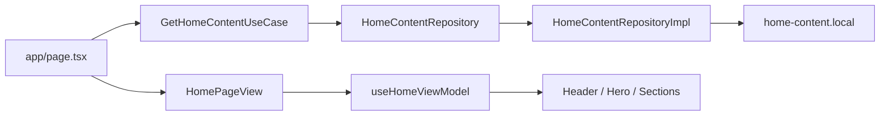

# Architecture

## MVVM (Model-View-ViewModel)

**MVVM** is an architectural pattern that separates the UI, business logic, and data layers. It improves code maintainability, testability, scalability, and enables reactive UI updates through a clear separation of concerns.

## Clean Architecture

**Clean Architecture** organises an application into independent layers (Presentation, Domain, and Data), ensuring business logic remains independent of frameworks, databases, and UI. This creates scalable, testable, and maintainable applications.

## Combined approach

**MVVM with Clean Architecture** provides a modular and scalable application structure by separating presentation, business logic, and data access into independent layers. It promotes clean code, reusability, easier testing, maintainability, and long-term scalability while following SOLID principles and dependency inversion.

### One-line version

**MVVM + Clean Architecture:** A scalable, maintainable, and testable architecture that separates UI, business logic, and data using clean layering and SOLID principles.

## Project layout

```text
src/
  app/                         # Next.js routes (thin entrypoints)
  domain/                      # Entities, repository contracts, use cases
  data/                        # Datasources + repository implementations
  presentation/                # Views (React) + ViewModels
  di/                          # Composition root / dependency wiring
```

### Dependency rule

- `presentation` → `domain` (+ ViewModels)
- `data` → `domain`
- `app` / `di` wire implementations together
- `domain` never imports React, Next.js, or data details

### Home page flow


